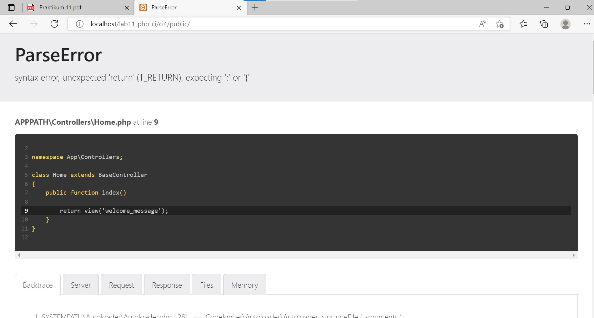

# Lab9Web

Tugas Pemrograman Web - Pertemuan 11

Praktikum 9

<hr>

Nama : Andriansyah <br>
Nim : 312010011 <br>
Kelas : TI.20.B1

<hr>

**Persiapan**

Persiapkan text editor misalnya VSCode.

Buat folder baru dengan nama lab11_php_ci pada docroot webserver (htdocs)


Sebelum memulai menggunakan Framework Codeigniter, perlu dilakukan konfigurasi
pada webserver. Beberapa ekstensi PHP perlu diaktifkan untuk kebutuhan
pengembangan Codeigniter 4.

Berikut beberapa ekstensi yang perlu diaktifkan:

• php-json ekstension untuk bekerja dengan JSON;

• php-mysqlnd native driver untuk MySQL;

• php-xml ekstension untuk bekerja dengan XML;

• php-intl ekstensi untuk membuat aplikasi multibahasa;

• libcurl (opsional), jika ingin pakai Curl.

Untuk mengaktifkan ekstentsi tersebut, masuk ke XAMPP Control Panel, pada bagian
Apache klik Config -> PHP.ini


Pada bagian extention, hilangkan tanda ; (titik koma) pada ekstensi yang akan
diaktifkan. Kemudian simpan kembali filenya dan restart Apache web server.


**1. Instalasi Codeigniter 4**

Untuk melakukan instalasi Codeigniter 4 dapat dilakukan dengan dua cara, yaitu cara
manual dan menggunakan composer. Pada praktikum ini kita menggunakan cara
manual.

• Unduh Codeigniter dari website https://codeigniter.com/download

• Extrak file zip Codeigniter ke direktori htdocs/lab11_ci.

• Ubah nama direktory framework-4.x.xx menjadi ci4.

• Buka browser dengan alamat http://localhost/lab11_php_ci/ci4/public/

**2. Menjalankan CLI (Command Line Interface)**

Codeigniter 4 menyediakan CLI untuk mempermudah proses development. Untuk
mengakses CLI buka terminal/command prompt.

Arahkan lokasi direktori sesuai dengan direktori kerja project dibuat
(xampp/htdocs/lab11_php_ci/ci4/)
Perintah yang dapat dijalankan untuk memanggil CLI Codeigniter adalah: php spark


**3. Mengaktifkan Mode Debugging**

Codeigniter 4 menyediakan fitur debugging untuk memudahkan developer untuk
mengetahui pesan error apabila terjadi kesalahan dalam membuat kode program.

Secara default fitur ini belum aktif. Ketika terjadi error pada aplikasi akan ditampilkan
pesan kesalahan seperti berikut.


Semua jenis error akan ditampilkan sama. Untuk memudahkan mengetahui jenis errornya, maka perlu mengaktifkan mode debugging dengan mengubah nilai konfigurasi pada environment variable **CI_ENVIRONMENT** menjadi **development** .

Ubah nama file env menjadi .env kemudian buka file tersebut dan ubah nilai variable
CI_ENVIRINMENT menjadi development.


Sebagai contoh, saya akan menghilangkan salah satu syntax di dalam programnya dan akan menampilkan pesan error pada browser.



Dan yang terakhir, ubah kode pada file app/Controller/Home.php kemudian hilangkan titik koma (;) pada akhir kode seperti berikut.

**4. Membuat Route Baru .**

Tambahkan kode berikut di dalam Routes.php

```
$routes->get('/about', 'Page::about');
$routes->get('/contact', 'Page::contact');
$routes->get('/faqs', 'Page::faqs');
```


Untuk mengetahui route yang ditambahkan sudah benar, buka CLI dan jalankan
perintah berikut.

php spark routes


Selanjutnya coba akses route yang telah dibuat dengan mengakses alamat url
http://localhost/lab11_php_ci/ci4/public/about

Ketika diakses akan mucul tampilan error 404 file not found, itu artinya file/page
tersebut tidak ada. Untuk dapat mengakses halaman tersebut, harus dibuat terlebih
dahulu Contoller yang sesuai dengan routing yang dibuat yaitu Contoller Page.

**Membuat Controller**

Selanjutnya adalah membuat Controller Page. Buat file baru dengan nama page.php
pada direktori Controller kemudian isi kodenya seperti berikut.

```
<?php
namespace App\Controllers;
class Page extends BaseController
{
 public function about()
 {
 echo "Ini halaman About";
 }
 public function contact()
 {
 echo "Ini halaman Contact";
 }
 public function faqs()
 {
 echo "Ini halaman FAQ";
 }
}
```

Maka tampilan halamanya akan seperti berikut.


**Auto Routing**

Secara default fitur autoroute pada Codeiginiter sudah aktif. Untuk mengubah status
autoroute dapat mengubah nilai variabelnya. Untuk menonaktifkan ubah nilai true
menjadi false.

```
$routes->setAutoRoute(true);
```

Tambahkan method baru pada Controller Page seperti berikut.

```
public function tos()
{
 echo "ini halaman Term of Services";
}

```


Method ini belum ada pada routing, sehingga saya mengaksesnya dengan menggunakan
alamat: http://localhost/lab11_php_ci/ci4/public/page/tos

**Membuat View**

Selanjutnya adalam membuat view untuk tampilan web agar lebih menarik. Buat file
baru dengan nama about.php pada direktori view (app/view/about.php) kemudian isi
kodenya seperti berikut.

```
<!DOCTYPE html>
<html lang="en">
<head>
 <meta charset="UTF-8">
 <title><?= $title; ?></title>
</head>
<body>
 <h1><?= $title; ?></h1>
 <hr>
 <p><?= $content; ?></p>
</body>
</html>
```

Ubah method about pada class Controller Page menjadi seperti berikut:

```
public function about()
{
 return view('about', ['title' => 'Halaman About','content' => 'Ini adalah halaman abaut yang menjelaskan tentang isi halaman ini.']);
}
```

Kemudian lakukan refresh pada halaman tersebut.


**Membuat Layout Web dengan CSS**

Pada dasarnya layout web dengan css dapat diimplamentasikan dengan mudah pada
codeigniter. Yang perlu diketahui adalah, pada Codeigniter 4 file yang menyimpan asset
css dan javascript terletak pada direktori public.

Buat file css pada direktori public dengan nama style.css (copy file dari praktikum
lab4_layout. Kita akan gunakan layout yang pernah dibuat pada praktikum 4.


Kemudian buat folder template pada direktori view kemudian buat file header.php dan
footer.php


File app/view/template/header.php


Kemudian ubah file app/view/about.php seperti berikut.

```
<?= $this->include('template/header'); ?>
<h1><?= $title; ?></h1>
<hr>
<p><?= $content; ?></p>
<?= $this->include('template/footer'); ?>
```

Maka hasilnya akan seperti berikut.


**Pertanyaan dan Tugas**

Lengkapi kode program untuk menu lainnya yang ada pada Controller Page, sehingga
semua link pada navigasi header dapat menampilkan tampilan dengan layout yang
sama.

Jawab :

Menu Kontak


Menu Artikel


