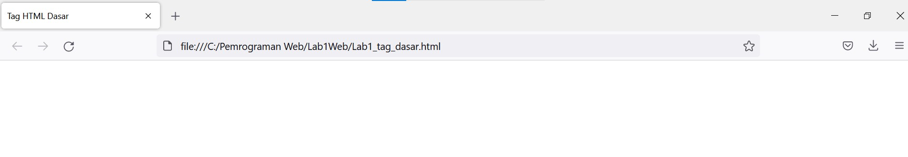

# Lab1Web

Tugas Pemrograman Web - Pertemuan 2

Nama : Andriansyah  
Nim : 312010011  
Kelas : TI.20.B1

## Praktikum

Menampilkan tag Title HTML pada browser

1.**Membuat Paragraf**

Untuk membuat paragraf pada file HTML, gunakan syntax < p > untuk membuat paragraf baru. Berikut tampilannya.

-**Perataan Paragraf**

Pada Poin ini saya akan merubah perataan paragraf yg sudah tersedia, yaitu paragraf pertama menjadi rata tengah, paragraf kedua jadi rata kanan. Berikut tampilannya.

2.**Membuat Judul**

Untuk membuat judul gunakan tag < h1 > sampai < h6 >. Kemudian tambahkan judul < h1 > sebelum paragraf pertama dan tambahkan sub judul < h2 > sebelum paragraf kedua. Berikut Tampilannya

3.**Memformat Teks**

Seperti di Modul Praktikum yang di jelaskan ada beberapa pemformatan teks yg bisa digunakan,seperti membuat huruf miring dengan tag < i >, menebalkan teks dengan tag < b >, sampai membuat subscrpit. Berikut Tampilan salah satunya.

4.**Menyisipkan Gambar**

Untuk menyisipkan gambar, siapkan gambar yang akan disisipkan pada halaman web, kemudian simpan file gambar tersebut satu folder dengan file dokumen html. Masukan lebar atau tinggi gambar sesuai yg diinginkan, disini saya hanya membuat lebar gambar atau width nya saja menjadi = 200, Lalu Eksekusi tag nya. Tag yang digunakan untuk menampilkan gambar adalah < img > dengan atribut src sebagai URL atau Path file gambar berada. Berikut Hasil Tampilannya.

5.**Menambahkan Hyperlink**

Untuk menambah link lihat di modul praktikum, Tambahkan hyperlink pada dokumen sebelum heading 1. Maka tampilannya seperti ini.

## Soal & Pembahasan

1.  Lakukan perubahan pada kode sesuai dengan keinginan anda, amati perubahannya adakah
    error ketika terjadi kesalahan penulisan tag?

    **Jawab** :

    Ketika terjadi kesalahan penulisan tag bisa saja menjadi error, Misalkan ketika saya ingin menebalkan teks "Pemrograman Web " pada paragraf pertama, tetapi saya hanya memberi tag pembuka saja tidak memberi tag penutupnya, maka ketika di buka hasil teks setelah pemrograman web sampai akhir akan menjadi teks tebal , seperti berikut.

    

2.  Apa perbedaan dari tag < p > dengan tag < br >, berikan penjelasannya!

    **Jawab** :

    Tag < p > berfungsi untuk membuat paragraf baru pada halam html antara baris atau paragraf yang terbentuk jarak. Tag ini pun diawali dengan tag pembuka dan diakhiri dengan tag penutup.

    Tag < br > artinya (break line) fungsinya untuk membuat baris baru atau bisa disebut membuat enter. Tag ini bersifat single tidak harus diakhiri tag penutup

3.  Apa perbedaan atribut title dan alt pada tag
    < img > berikan penjelasannya!

    **Jawab** :

    Atribut title itu untuk membuat judul gambar, Sedangkan alt adalah singkatan dari alternative description, dimana alt digunakan untuk mendeskripsikan gambar atau keterangan dari gambar jika gambar tersebut gagal ditampilkan oleh browser.

4.  Untuk mengatur ukuran gambar, digunakan atribut width dan height. Agar tampilan gambar
    proporsional sebaiknya kedua atribut tersebut diisi semua atau tidak? Berikan penjelasannya!

    **Jawab** :

    Karena width = Lebar sedangkan height itu adalah tinggi. Tentu sebaiknya digunakan semua karena jika hanya digunakan salah satunya maka tampilan gambar akan kurang menarik dan tidak seimbang.

5.  Pada link tambahkan atribut target dengan nilai atribut bervariasi ( \_blank, \_self, \_top,
    \_parent ), apa yang terjadi pada masing-masing nilai antribut tersebut?

    **Jawab** :

    - \_blank, berfungsi untuk membuka link pada jendela atau tab baru
    - \_self, berfungsi untuk membuka link pada halaman itu sendiri atau (default)
    - \_top , berfungsi untuk membuka link pada jendela baru dan full screen atau tampilan layar penuh
    - \_parent , berfungsi untuk membuka link di frame yang satu tingkat di atas frame link tersebut berada.
      secara simple-nya begini :
      jika di website(1) di dalamnya ada website(2) lalu di website(2) ini ada link dan kita klik, maka link akan terbuka di website(1)
