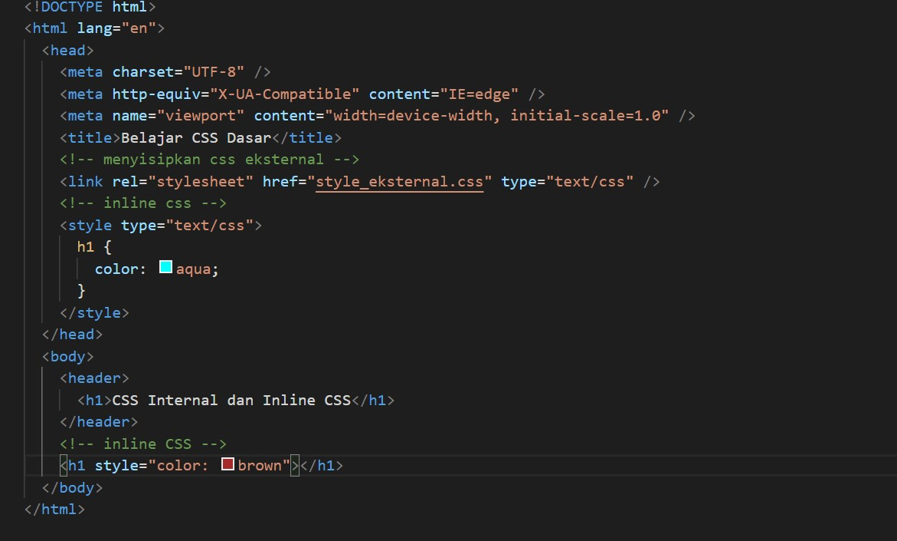
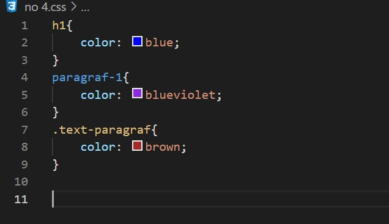
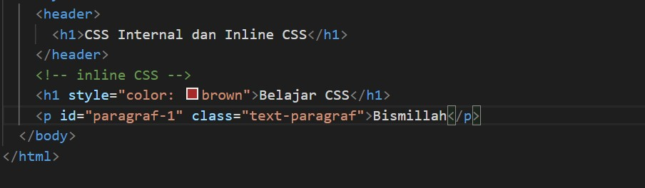
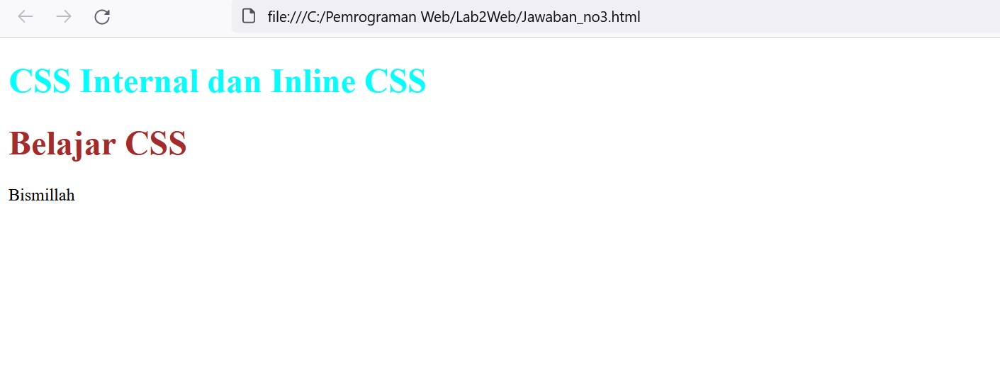

# Lab2Web

Tugas Pemrograman Web - Pertemuan 3

Nama : Andriansyah  
Nim : 312010011  
Kelas : TI.20.B1

## Praktikum

1.**Membuat Dokumen HTML dan Membuat css internal**

Buatlah sebuah doc html lalu seperti contoh berikut.

setelah itu buka browser untuk melihat hasilnya.

2.**Mendeklarasikan CSS Internal**

Untuk mendeklarasikan CSS Internal , tambahkan ke dalam bagian head dokumen seperti berikut.

setelah itu lalu save , dan hasilnya akan seperti ini

3.**Menambahkan Inline CSS**

Tambahkan deklarasi inline CSS pada tag 
 seperti berikut ini.

Simpan perubahannya, maka hasilnya akan seperti berikut ini.

4.**Membuat CSS Eksternal**

Buatlah file baru dengan nama style_eksternal.css kemudian buatlah deklarasi CSS seperti berikut.

Seperti biasa save , lalu refresh kembali browsernya maka akan seperti berikut ini.

5.**Menambahkan CSS Selector**

Untuk menambahkan CSS Selector menggunakan ID dan Class Selector pada file
style_eksternal.css, tambahkan kode berikut ini.

Setelah itu save, dan refresh kembali. Maka akan seperti berikut.

## Soal & Pembahasan

1.  Lakukan eksperimen dengan mengubah dan menambah properti dan nilai pada kode CSS
    dengan mengacu pada CSS Cheat Sheet yang diberikan pada file terpisah dari modul ini.

Jawab :

2.  Apa perbedaan pendeklarasian CSS elemen h1 {...} dengan #intro h1 {...}? berikan
    penjelasannya!

Jawab :

Perbedaaannya jika elemen h1{} maka akan merubah semua yang ada didalam elemen h1 saja, sedangkan #intro h1{} akan merubah yang memiliki tag intro h1

3.  Apabila ada deklarasi CSS secara internal, lalu ditambahkan CSS eksternal dan inline CSS pada elemen yang sama. Deklarasi manakah yang akan ditampilkan pada browser? Berikan
    penjelasan dan contohnya!

Jawab :

jika ketiga CSS merubah elemen yang sama maka deklarasi tersebut akan mengikuti aturan prioritas dimana prioritas CSS nya seperti ini:

- inline CSS
- ID selector CSS
- internal CSS
- external CSS

Seperti gambar dibawah ini.

maka yang akan muncul seperti ini

4.  Pada sebuah elemen HTML terdapat ID dan Class, apabila masing-masing selector tersebut
    terdapat deklarasi CSS, maka deklarasi manakah yang akan ditampilkan pada browser?
    Berikan penjelasan dan contohnya! ( < p id="paragraf-1" class="text-paragraf"> )

Jawab :

Sekian dan Terimakasih
