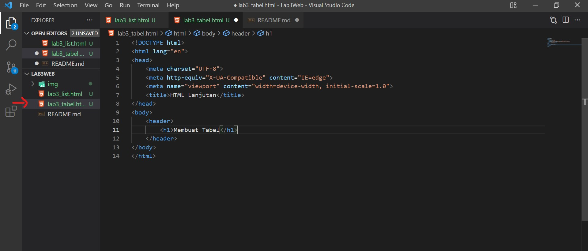
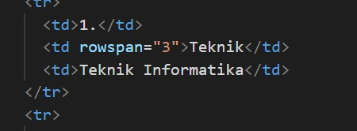
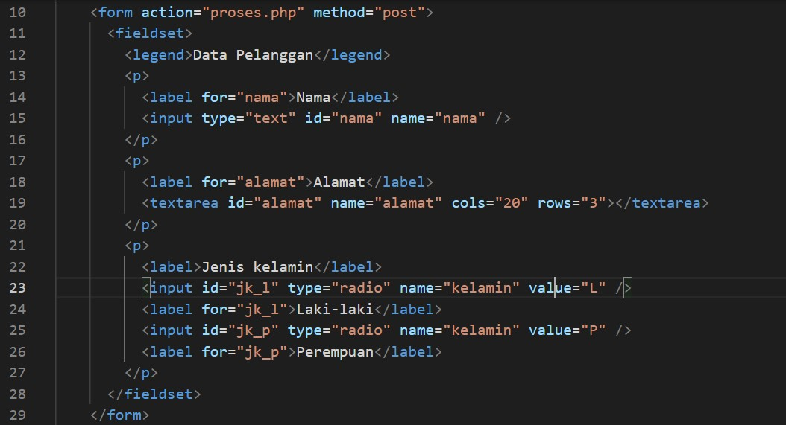
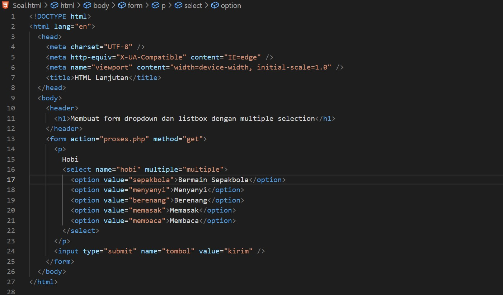

# Lab3Web

Tugas Pemrograman Web - Pertemuan 4

Nama : Andriansyah  
Nim : 312010011  
Kelas : TI.20.B1

## Praktikum

Langkah awal buatlah dokumen HTML dengan nama file " lab3_list.html " seperti berikut.

**1. Membuat Ordered List**

Ordered list dibuat dengan tag < ol >. Lalu di dalamnya diisi dengan item-item yang akan dimasukkan ke dalam list. Item dibuat dengan tag < li > (list item). Contohnya seperti berikut.

Lalu hasilnya akan seperti ini

**2. Membuat Unorderd List**

Kemudian tambakan kode untuk membuat Unordered List, setelah deklarasi ordered list pada
section unordered-list, seperti berikut.

Disini saya menambahkan atribut "type" pada tag < ul > dan memberikan nilai "square" untuk simbol persegi. Jika dilihat hasilnya akan seperti berikut.

**3. Membuat Description List**

Kemudian tambahkan kode untuk membuat description list setelah deklarasi unorderd-list.

Description List digunakan untuk membuat daftar dimana tiap daftar tersebut memiliki penjelasan (sub-bagian).

Ada tiga tag yang digunakan untuk membuat description list, yaitu:

• < dl > (description list) tag untuk memulai description list;

• < dt > (description term) tag untuk membuat kata yang akan dideskripsikan;

• < dd > (description description) tag untuk membuat penjelasan dari kata.

Lalu hasilnya akan seperti berikut.

**4. Membuat Tabel**

Buat file baru dengan nama lab3_tabel.html seperti berikut.

Kemudian selanjutnya tambahkan kode untuk membuat tabel sederhana seperti berikut:

Jika dilihat maka hasilnya akan seperti ini

HTML Table dapat dibuat dengan tag sebagai berikut.

< table > Mendefinisikan sebuah tabel dalam dokumen HTML. Atribut: border, cellpadding, cellspacing

< thead > untuk membungkus bagian kepala tabel

< tbody > untuk membungkus bagian body dari tabel

< th > Membuat judul kolom

< tr > Mendefinisikan baris dalam tabel.

Atribut: align (left, center, right), valign (top, middle,
bottom)

< td > Mendefinisikan kolom tabel.

Atribut: align (left, center, right), valign (top, middle,
bottom), colspan, rowspan.

Tag yang paling penting untuk diingat adalah tag
< table >, < tr >, dan < td >. Sementara tag yang lain adalah tambahan (opsional), boleh digunakan boleh tidak.

**Mengatur Margin dan Padding**

Untuk mengatur margin dan padding pada cel data, tambahkan atribut cellpadding dan cellspacing pada tag table

< table border="1" cellpadding="4" cellspacing="0" >

**Menggabungkan Sel Data**

Untuk menggabungkan sel data, gunakan atribut rowspan dan colspan. Atribut rowspan untuk
menggabungkan baris (secara vertikal) dan colspan untuk menggabungkan kolom (secara horizontal).

Refresh browser dan lihat hasilnya.

**5. Membuat Form**

Buat file baru dengan nama lab3_form.html seperti berikut.

Untuk membuat form digunakan tag < form > dengan atribut action dan method. Atribut action
untuk menentukan aksi yang akan digunakan pada saat form dikirim. Dan method adalah untuk
menentukan metode yang digunakan dalam mengirimkan data

Kemudian selanjutnya tambahkan kode untuk membuat tabel sederhana seperti berikut:

Jika dilihat maka hasilnya seperti berikut.

**Menambahkan Style pada Form**

Agar tampilan form lebih menarik, bisa ditambahkan CSS seperti berikut

Dan jika di refresh maka akan seperti berikut.

## Pertanyaan dan Tugas

Buatlah form yang menampilkan dropdown menu dan listbox dengan multiple selection.

Jawab :

Disini saya mencontohkan menu pilihan untuk Hobi .

Contoh codingan seperti berikut.

Maka hasilnya seperti berikut.

Untuk memilih pilihan lebih dari satu tekan ctrl lalu pilih pilihan yg lainnya sesuai hobi masing-masing.
