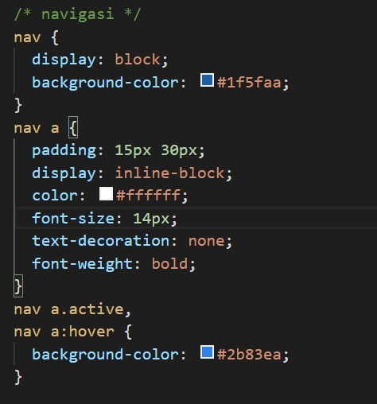

# Lab4Web

Tugas Pemrograman Web - Pertemuan 2

Nama : Andriansyah  
Nim : 312010011  
Kelas : TI.20.B1

## Praktikum

Langkah awal buatlah dokumen HTML dengan nama file " lab4_box.html " seperti berikut.

**1. Membuat Box Element**

Untuk membuat box element gunakan tag < div > seperti berikut.

Lalu hasilnya akan seperti ini

Selanjutnya tambahkan deklarasi CSS pada head untuk membuat float element, seperti berikut.

Setelah itu refresh browser dan lihat hasilnya.

**Mengatur Clearfix Element**

**Clearfix** digunakan untuk mengatur element setelah float element. Property clear digunakan untuk mengaturnya. Tambahkan element div lainnya setelah div3 seperti berikut.

Kemudian atur property clear pada CSS, seperti berikut.

Selanjutnya buka browser dan refresh kembali.

**2. Membuat Layout Sederhana**

Buat folder baru dengan nama lab4_layout, kemudian buatlah file baru didalamnya dengan nama
home.html, dan file css dengan nama style.css.

Kemudian buat kerangka layout dengan semantics element seperti berikut.

Kemudian tulis kode berikut.

Lalu buka browser dan lihat hasilnya.

Untuk selanjutnya tambahkan kode CSS untuk membuat layoutnya.

**3. Membuat Navigasi**

Kemudian tambahkan kode berikut untuk membuat navigasi

Kemudian lihat hasilnya.

**4. Membuat Hero Panel**

Selanjutnya membuat hero panel. Tambahkan kode HTML dan CSS seperti berikut.

Maka hasilnya akan eperti berikut.

**5. Mengatur Layout Main dan Sidebar**

Selanjutnya untuk mengatur main content dan sidebar, tambahkan CSS float.

**6. Membuat Sidebar Widget**

Selanjutnya menambahkan element lain dalam sidebar.

Kemudian tambahkan CSS nya.

Maka jika dilihat hasilnya akan seperti berikut.

**5. Mengatur Footer**

Selanjutnya mengatur tampilan footer. Tambahkan CSS untuk footer.

Lalu refresh browser dan lihat hasilnya.

**6. Menambahkan Elemen lainnya pada Main Content**

Agar tampilan form lebih menarik, bisa ditambahkan CSS seperti berikut.

Lihat Hasilnya di browser.

**7. Menambahkan Content Artikel**

Selanjutnya untuk membuat content artikel. Tambahkan HTML berikut pada main content

Kemudian tambahkan CSS

Maka hasilnya akan seperti berikut.

## Pertanyaan dan Tugas

**1. Tambahkan Layout untuk menu About**

=> buat single layout yang berisi deskripsi, portfolio, dll

**2. Tambahkan layout untuk menu Contact**

=> yang berisi form isian: nama, email, message, dl

Jawab :

Untuk Menjawab pertanyaan 1 dan 2 disini saya menggunakan css framework bootsrap

1 . Tambahkan kode berikut dalam element section main content

2 . Tambahkan kode berikut pada element sidebar

Lalu hasilnya akan seperti berikut ini.

## Sekian dan Terimakasih
