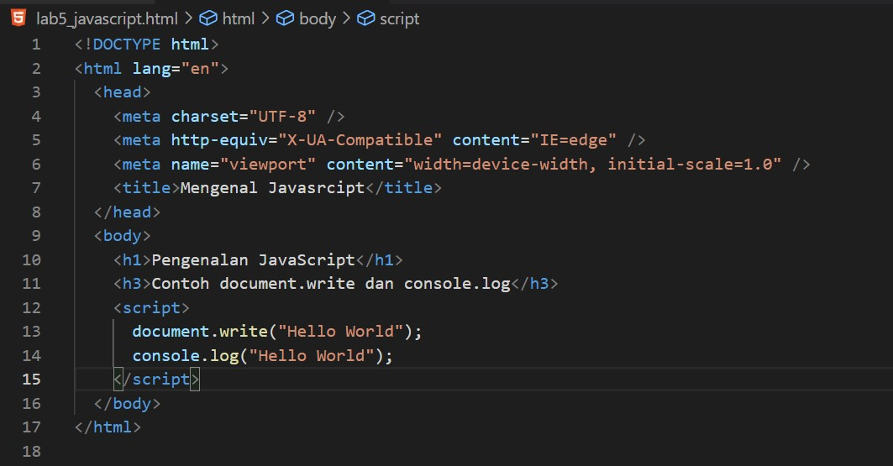

# Lab5Web

Tugas Pemrograman Web - Pertemuan 6

Nama : Andriansyah  
Nim : 312010011  
Kelas : TI.20.B1

## Praktikum

Persiapan membuat dokumen HTML dengan nama file lab5_javascript.html seperti berikut.

Lalu lihat hasilnya di browser.

**1. Javascript Dasar**

Pemakaian Alert sebagai property window.

Lalu jika dibuka hasilnya akan seperti ini.

Pemakaian method dalam objek

Setelah itu lihat hasilnya.

Pemakaian Prompt

Kemudian akan muncul seperti berikut. Isi nama anda lalu klik oke .

Pembuatan fungsi dan cara pemanggilannya

Kemudian Hasilnya akan seperti ini.

**2. Dasar Pemrograman Di Javascript**

Operasi dasar aritmatika. Disini kita menggunakan nilai pertama 9 dan yg kedua 4.

Kemudian lihat hasilnya.

Seleksi kondisi (if..else)

Maka jika dilihat hasilnya akan seperti berikut. Disini saya mencontohkan memasukan angka 10 dan hasilnya sesuai yaitu tidak lulus , karena nilai yg dianggap lulus diatas 60.

Penggunaan operator switch untuk seleksi kondisi

Maka hasilnya akan seperti berikut.

**3. Pembuatan Form**

Form input

Jika dilihat hasilnya seperti berikut.

Form Button

Buka hasilnya di browser. Berikut beberapa hasilnya.

**4. HTML Dom**

Disini menggunakan pilihan chekbox dengan perhitungan otomatis

Lalu buka hasilnya di browser.

## Pertanyaan dan Tugas

**1. Buat script untuk melakukan validasi pada isian form.**

Jawab :

Disini saya membuat form baru kode nya seperti berikut.

Dan akan memvalidasi jika ada isian yg tidak diisi.

## Sekian dan Terimakasih
