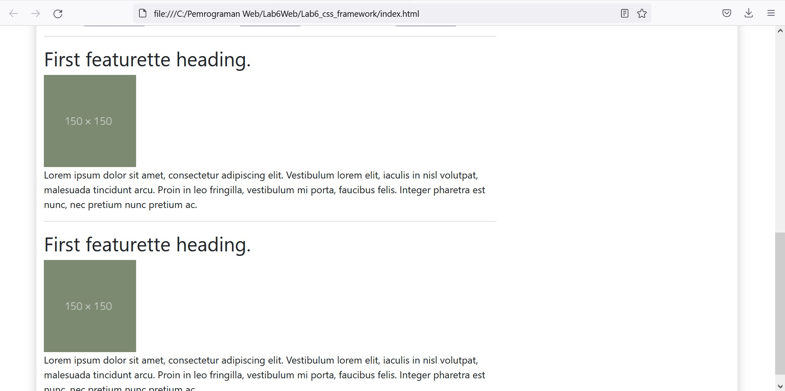

# Lab6Web

Tugas Pertemuan 7 - Pemrograman Web

<hr>

Nama : Andriansyah <br>
Nim : 312010011 <br>
Kelas : TI.20.B1

<hr>

## Soal

Buatlah Sebuah Layout sederhana seperti pada tugas praktikum 4. Tetapi dengan menggunakan css framework (twitter bootstrap).

**Membuat Header , Hero , dan Navigation menu**

Disini saya tidak mengunduh file bootsrap nya melainkan saya membuat layout dengan menggunakan bootstrap cdn dimana penggunaan nya harus menggunakan koneksi internet atau online. Dan ssaya juga disini masih menggunakan css eksternal untuk modified nya.

Berikut Source code pembuatan header, nav, dan section hero di file index.html

```
<!DOCTYPE html>
<html lang="en">
  <head>
    <meta charset="UTF-8" />
    <meta http-equiv="X-UA-Compatible" content="IE=edge" />
    <meta name="viewport" content="width=device-width, initial-scale=1.0" />
    <title>Tugas Pertemuan 7</title>
    <link href="https://cdn.jsdelivr.net/npm/bootstrap@5.1.3/dist/css/bootstrap.min.css" rel="stylesheet" integrity="sha384-1BmE4kWBq78iYhFldvKuhfTAU6auU8tT94WrHftjDbrCEXSU1oBoqyl2QvZ6jIW3" crossorigin="anonymous" />
    <link href="style.css" rel="stylesheet" type="text/css" />
  </head>
  <body>
    <div class="container" style="box-shadow: 0 0 1em #cccccc">
      <div class="row">
        <header>
          <h1>Layout Sederhana</h1>
        </header>
      </div>
      <div class="row">
        <nav class="navbar navbar-expand-lg navbar-dark bg-primary">
          <div class="container-fluid">
            <div class="collapse navbar-collapse" id="navbarNav">
              <ul class="navbar-nav">
                <li class="nav-item">
                  <a class="nav-link active" aria-current="page" href="#">Home</a>
                </li>
                <li class="nav-item">
                  <a class="nav-link" href="#">Article</a>
                </li>
                <li class="nav-item">
                  <a class="nav-link" href="#">About</a>
                </li>
                <li class="nav-item">
                  <a class="nav-link" href="#">Kontak</a>
                </li>
              </ul>
            </div>
          </div>
        </nav>
      </div>
      <div class="row">
        <section id="hero">
          <h1>Hello World</h1>
          <p>
            Lorem, ipsum dolor sit amet consectetur adipisicing elit. Omnis laboriosam aspernatur ipsa magnam nulla voluptatem reiciendis! Exercitationem doloribus, quos nesciunt aut nobis cum consequatur expedita ad ex veniam assumenda
            provident?
          </p>
          <a class="btn btn-primary btn-sm" href="#" role="button">Learn More</a>
        </section>
      </div>
    </div>
  </body>
</html>

```

Dan jika dilihat hasilnya akan seperti berikut.


**Membuat 2 kolom, 1 kolom Heading dan 1 kolom buat Widget Header**

Disini saya akan membuat 2 kolom , kolom sisi kiri untuk Heading dan kolom sisi kanan untuk widget Header.

Berikut source code yang saya buat.

```

<div class="row text-center">
            <div class="col">
              <div class="box">
                
                <h3>Heading</h3>
                <p>Donec sed odio dui. Etiam porta sem malesuada magna mollis euismod.</p>
                <button type="button" class="btn btn-secondary">View detail</button>
              </div>
            </div>
            <div class="col">
              <div class="box">
                
                <h3>Heading</h3>
                <p>Donec sed odio dui. Etiam porta sem malesuada magna mollis euismod.</p>
                <a href="#" class="btn btn-secondary">View detail</a>
              </div>
            </div>
            <div class="col">
              <div class="box">
                
                <h3>Heading</h3>
                <p>Donec sed odio dui. Etiam porta sem malesuada magna mollis euismod.</p>
                <a href="#" class="btn btn-secondary">View detail</a>
              </div>
            </div>
          </div>

```

Lalu hasilnya akan seperti ini. Disini saya hanya baru membuat kolom heading untuk bagian kiri, sedangkan untuk kolom bagian kanan saya semntara masih tulis dengan text lorem.


Selanjutnya, Pada bagian ini saya menambahkan article content masih di kolom kiri menambahkannya dibawah main content yg pertama tadi . Untuk source code nya seprti berikut.

```
<hr class="divider" />
          <article class="entry">
            <h2>First featurette heading.</h2>
            
            <p>
              Lorem ipsum dolor sit amet, consectetur adipiscing elit. Vestibulum lorem elit, iaculis in nisl volutpat, malesuada tincidunt arcu. Proin in leo fringilla, vestibulum mi porta, faucibus felis. Integer pharetra est nunc, nec
              pretium nunc pretium ac.
            </p>
          </article>
          <hr class="divider" />
          <article class="entry">
            <h2>First featurette heading.</h2>
            
            <p>
              Lorem ipsum dolor sit amet, consectetur adipiscing elit. Vestibulum lorem elit, iaculis in nisl volutpat, malesuada tincidunt arcu. Proin in leo fringilla, vestibulum mi porta, faucibus felis. Integer pharetra est nunc, nec
              pretium nunc pretium ac.
            </p>
          </article>

```

Dan jika dilihat akan seperti berikut.



**Membuat widget menggunakan list group**

Untuk selanjutnya saya akan membuat widget yang dibagian kolom sebelah kanan yg tadi diatas masih saya isi dengan text lorem. Disini saya menggunkan list group untuk membuatnya. Berikut source codenya.

```
<div class="col-4">
          <ul class="list-group">
            <li class="list-group-item active" aria-current="true">Widget Header</li>
            <li class="list-group-item">Widget Link</li>
            <li class="list-group-item">Widget Link</li>
            <li class="list-group-item">Widget Link</li>
            <li class="list-group-item">Widget Link</li>
            <li class="list-group-item">Widget Link</li>
          </ul>
          <br>
          <ul class="list-group">
            <li class="list-group-item active" aria-current="true">Widget Text</li>
            <li class="list-group-item">Vestibulum lorem elit, iaculis in nisl volutpat, malesuada tincidunt
              arcu. Proin in leo fringilla, vestibulum mi porta, faucibus felis. Integer
              pharetra est nunc, nec pretium nunc pretium ac.</li>
          </ul>
        </div>
      </div>
```

Berikut hasilnya.


**Membuat Footer**

Untuk membuat footer saya menggunakan grid dalam pembuatannya. Source code nya seperti berikut.

```
<div class="row">
  <div class="col bg-dark text-white" style="padding: 20px;">&copy; 2021 - Universitas Pelita Bangsa</div>
</div>
```

Dan Hasilnya akan seperti berikut.


