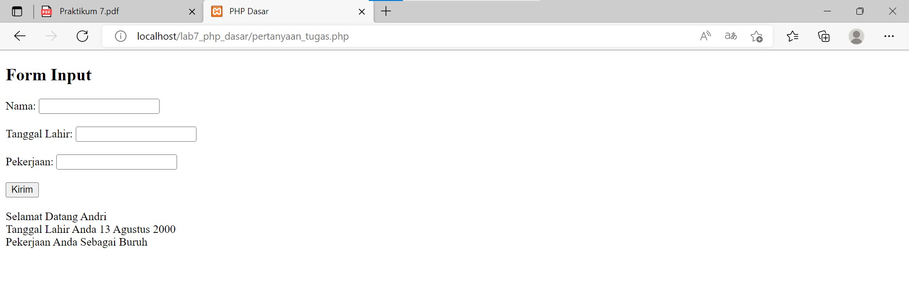

# Lab7Web

Tugas Pertemuan 9 - Pemrograman Web

<hr>

Nama : Andriansyah <br>
Nim : 312010011 <br>
Kelas : TI.20.B1

<hr>

**1. Memulai PHP**

Buat folder lab7_php_dasar pada root directory web server misalnya (c:\xampp\htdocs)

Seperti contoh berikut.


Kemudian untuk mengakses direktory tersebut pada web server dengan mengakses URL :
http://localhost/lab7_php_dasar/

Berikut hasilnya.


**2. PHP Dasar**

Buat file baru dengan nama "php_dasar.php" pada directory tersebut. Kemudian buat
kode seperti berikut.

```
<!DOCTYPE html>
<html lang="en">
<head>
 <meta charset="UTF-8">
 <title>PHP Dasar</title>
</head>
<body>
 <h1>Belajar PHP Dasar</h1>
 <?php
 echo "Hello World";
 ?>
</body>
</html>
```

Kemudian untuk mengakses hasilnya melalui URL:
http://localhost/lab7_php_dasar/php_dasar.php


**3. Variable PHP**

Menambahkan variable pada program.

```
<h2>Menggunakan Variable</h2>
<?php
$nim = "312010011";
$nama = 'Andriansyah';
echo "NIM : " . $nim . "<br>";
echo "Nama : $nama";
?>
```

Refresh lalu hasilnya seperti berikut.


**4. Predefine Variable** $\_GET

```
<?php
echo 'Selamat Datang ' . $_GET['Andri'];
?>
```

Untuk mengaksesnya gunakan URL:
http://localhost/lab7_php_dasar/latihan2.php?nama=Andri


**5. Membuat Form Input**

```
<!DOCTYPE html>
<html lang="en">
<head>
 <meta charset="UTF-8">
 <title>PHP Dasar</title>
</head>
<body>
<h2>Form Input</h2>
<form method="post">
 <label>Nama: </label>
 <input type="text" name="nama">
 <input type="submit" value="Kirim">
</form>
<?php
echo 'Selamat Datang ' . $_POST['nama'];
?>
</body>
</html>
```

Inputkan nama nya. Maka hasilnya akan seperti berikut.


Menambahkan Operator

```
    <!-- Operator -->
    <?php
    $gaji = 1000000;
    $pajak = 0.1;
    $thp = $gaji - ($gaji*$pajak);
    echo "Gaji sebelum pajak = Rp. $gaji <br>";
    echo "Gaji yang dibawa pulang = Rp. $thp";
    ?>

    <!-- Kondisi IF -->
    <?php
    $nama_hari = date("l");
    if ($nama_hari == "Sunday") {
        echo "Minggu";
    } elseif ($nama_hari == "Monday") {
        echo "Senin";
    } else {
        echo "Selasa";
    }
    ?>

    <!-- Kondisi Switch -->
    <?php
    $nama_hari = date("l");
    switch ($nama_hari) {
        case "Sunday":
            echo "Minggu";
            break;
        case "Monday":
            echo "Senin";
            break;
        case "Tuesday":
            echo "Selasa";
            break;
        default:
            echo "Sabtu";
    }
    ?>

    <!-- Perulangan for -->
    <?php
    echo "Perulangan 1 sampai 10 <br />";
    for ($i=1; $i<=10; $i++) {
        echo "Perulangan ke: " . $i . '<br />';
    }

    echo "Perulangan Menurun dari 10 ke 1 <br />";
    for ($i=10; $i>=1; $i--) {
        echo "Perulangan ke: " . $i . '<br />';
    }
    ?>

    <!-- Perulangan while -->
    <?php
    echo "Perulangan 1 sampai 10 <br />";
    $i=1;
    while ($i<=10) {
        echo "Perulangan ke: " . $i . '<br />';
        $i++;
    }
    ?>

    <!-- Perulangan dowhile -->
    <?php
    echo "Perulangan 1 sampai 10 <br />";
    $i=1;
    do {
        echo "Perulangan ke: " . $i . '<br />';
        $i++;
    } while ($i<=10);
    ?>
```

Jika dilihat seperti berikut.


## Pertanyaan dan Tugas

Buatlah program PHP sederhana dengan menggunakan form input yang menampilkan
nama, tanggal lahir dan pekerjaan. Kemudian tampilkan outputnya dengan menghitung
umur berdasarkan inputan tanggal lahir. Dan pilihan pekerjaan dengan gaji yang
berbeda-beda sesuai pilihan pekerjaan

Jawaban :

```
<!DOCTYPE html>
<html lang="en">
<head>
    <meta charset="UTF-8">
    <meta http-equiv="X-UA-Compatible" content="IE=edge">
    <meta name="viewport" content="width=device-width, initial-scale=1.0">
    <title>PHP Dasar</title>
</head>
<body>
    <h2>Form Input</h2>
    <form method="post">
        <label>Nama: </label>
        <input type="text" name="nama"><br><br>
        <label>Tanggal Lahir: </label>
        <input type="text" name="tanggal_lahir"><br><br>
        <label>Pekerjaan: </label>
        <input type="text" name="pekerjaan"><br><br>
        <input type="submit" value="Kirim">
    </form><br>
    <?php
    echo 'Selamat Datang ' . $_POST['nama']
    ?><br>
    <?php
    echo 'Tanggal Lahir Anda ' . $_POST['tanggal_lahir']
    ?><br>
    <?php
    echo 'Pekerjaan Anda Sebagai ' . $_POST['pekerjaan']
    ?>

</body>
</html>
```


