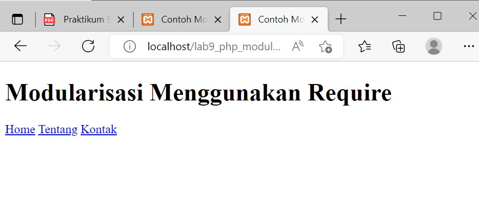

# Lab9Web

Tugas Pemrograman Web - Pertemuan 11

Praktikum 9

<hr>

Nama : Andriansyah <br>
Nim : 312010011 <br>
Kelas : TI.20.B1

<hr>

**Persiapan**

Persiapkan text editor misalnya VSCode.

Buat folder baru dengan nama lab9_php_modular pada docroot webserver (htdocs)

**Buat file baru dengan nama "header.php"**

Lalu buat script seperti berikut.

```
<!DOCTYPE html>
<html lang="en">

<head>
    <meta charset="UTF-8">
    <meta http-equiv="X-UA-Compatible" content="IE=edge">
    <meta name="viewport" content="width=device-width, initial-scale=1.0">
    <title>Contoh Modularisasi</title>
</head>

<body>
    <div class="container">
        <header>
            <h1>Modularisasi Menggunakan Require</h1>
        </header>
        <nav>
            <a href="home.php">Home</a>
            <a href="about.php">Tentang</a>
            <a href="kontak.php">Kontak</a>
        </nav>
    </div>
</body>

</html>
```

Maka hasilnya akan seperti berikut.



**2. Buat file baru dengan nama "footer.php"**

Lalu buat script seperti berikut.

```
<footer>
    <p>&copy; 2021, Informatika, Universitas Pelita Bangsa</p>
</footer>
</div>
</body>

</html>
```

Jika dilihat hasilnya akan seperti berikut.


**3. Buat file baru dengan nama "home.php"**

Lalu buat script seperti berikut.

```
<?php require('header.php'); ?>
<div class="content">
    <h2>Ini Halaman Home</h2>
    <p>Ini adalah bagian content dari halaman.</p>
</div>
<?php require('footer.php'); ?>
```

Jika dilihat hasilnya akan seperti berikut.


**4. Buat file baru dengan "nama about.php"**

Buat script seperti berikut.

```
<?php require('header.php'); ?>
<div class="content">
    <h2>Ini Halaman About</h2>
    <p>Ini adalah bagian content dari halaman.</p>
</div>
<?php require('footer.php'); ?>
```


**Pertanyaan dan Tugas**

Implementasikan konsep modularisasi pada kode program praktikum 8 tentang database, sehingga setiap halamannya memiliki template

Jawab:

untuk menyisipkan file modul nya disini saya menggunakan perintah include. contoh penulisannya seperti ini.

```
include('namafolder/header.php');
```

implementasikan kepada program yg ingin disispkan file modul nya.

Berikut hasil dari setiap halaman yg saya tambahkan modul. Disini modul yg saya tambahkan yaitu header, navbar, dan footer .

**- Index.php**


**- ubah.php**


**- tambah.php**

